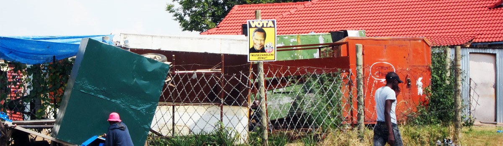
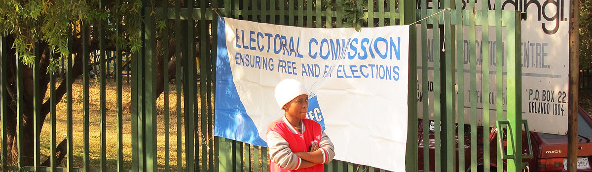

# Image Migration Guide

## Images Currently on Your WordPress Site

### Homepage Slider Images (4 images)
- `https://www.aaronerlich.com/wp-content/uploads/2016/12/slider01-1200x350.jpg`
- `https://www.aaronerlich.com/wp-content/uploads/2016/12/slider05-1200x350.jpg`
- `https://www.aaronerlich.com/wp-content/uploads/2016/12/slider02-1200x350.jpg`
- `https://www.aaronerlich.com/wp-content/uploads/2016/12/slider03-1200x350.jpg`

### Lab Member Photos
- David Dubé: `/wp-content/uploads/2024/10/dube_david_headshot.png`
- Rafael Campos-Gottardo: `/wp-content/uploads/2024/10/campos_gottardo_rafael_headshot.jpg`
- Katerina McMullen: `/wp-content/uploads/2024/10/mcmullen_katerina_MA.jpeg`
- Lawrence Plastina: `/wp-content/uploads/2024/10/plastina_lawrnce_headshot.jpg`
- Aaron Erlich (you): `/wp-content/uploads/2018/11/Erlich.jpg`

### Lab Photos (for slider)
- `/wp-content/uploads/2018/11/IMG_4706-2000x800.jpg`
- `/wp-content/uploads/2018/11/01084D82-62A0-41DC-87E4-A54AA0D571FD-1-2000x800.jpeg`
- `/wp-content/uploads/2019/02/spsa_lab-1499x599.jpg`

### Other
- Bike tour photo: `/wp-content/uploads/2010/12/biketour.jpg`

## Option 1: Download Images via Browser (Easiest)

1. Right-click each image URL above and "Save Image As..."
2. Save to your `aaronerlich-quarto/images/` folder
3. Use simple names like:
   - `slider01.jpg`, `slider02.jpg`, etc.
   - `headshot-dube.png`, `headshot-campos.jpg`, etc.
   - `profile.jpg` (for your headshot)
   - `lab-lunch.jpg`, `lab-presentation.jpg`, `lab-spsa.jpg`
   - `bike-tour.jpg`

## Option 2: Download from Bluehost (All at once)

1. Log into Bluehost → cPanel → File Manager
2. Navigate to `public_html/wp-content/uploads/`
3. Download these folders:
   - `2016/12/` (slider images)
   - `2024/10/` (current member headshots)
   - `2018/11/` (lab photos, your headshot)
   - `2019/02/` (SPSA lab photo)
   - `2010/12/` (bike tour)
4. Extract and move relevant images to `aaronerlich-quarto/images/`

## After Downloading Images

### Update index.qmd (Homepage)
Currently the slider is commented out. If you want a photo on homepage:

```markdown

```

Or create a simple image gallery:

```markdown
::: {layout-ncol=2}



:::
```

### Update lab.qmd (Lab Page)

Replace the current placeholder with:

```markdown
{width=150px}

**Aaron Erlich** is Associate Professor...

{width=150px}

**David Dubé** is a PhD candidate...
```

Or for a cleaner layout:

```markdown
::: {.grid}
::: {.g-col-2}
{width=150px}
:::
::: {.g-col-10}
**David Dubé** is a PhD candidate in Political Science...
:::
:::
```

## Quick Command to Set Up

```bash
cd aaronerlich-quarto
mkdir -p images

# Then download images as described above

# Commit them
git add images/
git commit -m "Add site images"
git push
```

## Don't Forget!

Images need to be committed to git or they won't appear on your live site!
