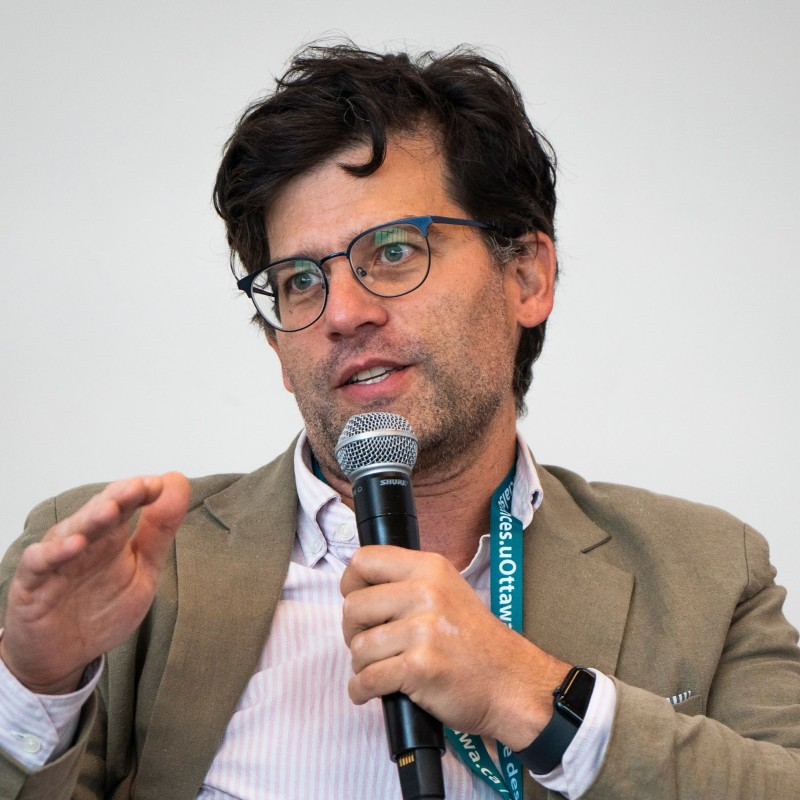

Welcome to my site! I am an Associate Professor in the Department of Political Science at McGill University, where I am a member of the Centre for the Study of Democratic Citizenship (CSDC) and an Associate Member of the Centre on Population Dynamics (CPD). I completed my Ph.D. at the University of Washington in Seattle.

Broadly speaking, I am interested in democratization and democratic development. Much of my research addresses the role that information plays in developing democratic polities. I am also interested in advancing quantitative methods to measure the effect of information. I maintain active research projects in the former Soviet Union, Eastern and Southern Africa, and North America. My work has appeared in a broad range of journals in political science and adjacent fields, such as <em>American Political Science Review</em>, <em>American Journal of Political Science</em>, <em>Comparative Political Studies</em>, <em>Journal of Politics</em>, <em>Journal of Public Administration Research &amp; Theory</em>, and <em>Political Analysis</em>, among others. You can see more about my academic work on my [C.V.](cv.qmd)

Before returning to academia, I worked for the National Democratic Institute covering Kenya and the Caucasus Research Resource Centers covering Armenia, Azerbaijan and Georgia.

I am an avid bicycle tourer.

## Contact me

Aaron Erlich, Associate Professor 
Department of Political Science 
McGill University 
3610 McTavish, Room 26-4 
Montreal, Quebec, Canada H3A 1Y2 
T: 514-398-4756 
F: 514-398-4938 
aaron.erlich [at] mcgill.ca

## Affiliations

[Centre for the Study of Democratic Citizenship](http://csdc-cecd.ca/) 
[Centre on Population Dynamics](https://www.mcgill.ca/popcentre/) 
[Center for Social Media and Politics](https://csmapnyu.org/)
