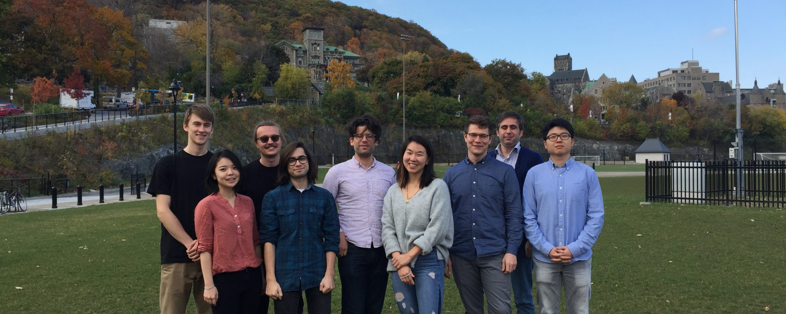

<!-- Once you add images, uncomment this slider section:
::: {.column-page}

:::
-->

Bringing together researchers interested in transparency, information provision, and participation (TIP), the DemoTIP laboratory applies state of the art research methods to bring answers to empirical problems in political science. Lab members test and challenge conventional theories regarding political transparency and accountability, the provision of political information, and citizen participation in democratic processes. Email if you are interested in getting involved!

## Principal Investigator

::: {.grid}
::: {.g-col-3}
<!-- Uncomment when you add images:  -->
:::
::: {.g-col-9}
**Aaron Erlich** is Associate Professor of Political Science at McGill University. He received his Ph.D. from the University of Washington in 2016. His wide-ranging research interests touch upon various themes such as democracy, political participation, the effect of information, and the development and use of advanced quantitative methods. His research has been published in journals such as the *American Political Science Review*, *Journal of Politics*, *Comparative Political Studies*, and many others.
:::
:::

## McGill Graduate & Post-Doc Researchers

::: {.grid}
::: {.g-col-3}
<!-- Uncomment when you add images:  -->
:::
::: {.g-col-9}
**David Dubé** is a PhD candidate in Political Science at McGill University, interested in the informal political economy of post-communist Europe and Eurasia and the relationship between (mis)information, beliefs, and political behaviour in democratic, hybrid and authoritarian regimes. As a graduate student, David developed a growing interest in using statistical methods for causal inference and machine learning (natural language processing & computer vision) for large datasets and complex data analysis.
:::
:::

::: {.grid}
::: {.g-col-3}
<!-- Uncomment when you add images:  -->
:::
::: {.g-col-9}
**Rafael Campos-Gottardo** is an M.A. student in political science at McGill University. His thesis examines the effect of partisan violence on levels of affective polarization in the United Kingdom. He is also interested in using casual inference techniques to study the consequences of affective polarization on democracy in a comparative context. He has worked with Professor Erlich on several Ukrainian survey-data-related project.
:::
:::

::: {.grid}
::: {.g-col-3}
<!-- Uncomment when you add images:  -->
:::
::: {.g-col-9}
**Katerina McMullen** is an M.A. student in Political Science at McGill University. Her research focuses on the socio-political analysis of large language models. Her thesis is assessing how LLMs handle and respond to queries about the US election when confronted with misleading or false information. She was awarded funding from the Social Science and Humanities Research Council (SSHRC) for that project.
:::
:::

## McGill Undergraduate Researchers

::: {.grid}
::: {.g-col-3}
<!-- Uncomment when you add images:  -->
:::
::: {.g-col-9}
**Lawrence Plastina** is a third-year undergraduate student double majoring in political science and statistics. He was one of 29 recipients of McGill's 2024 Arts Undergraduate Research Internship Award, using quantitative methods to study Ukrainian self-reported firearm ownership under Prof. Erlich's supervision.
:::
:::

## DemoTIP Alumni

These students worked with me closely. The research and publications are just those completed with me during their time affiliated with the lab. For prospective students, this table gives you a good sense of the types of students who work with me.

```{r}
#| echo: false
#| warning: false

library(DT)

# Create alumni data
alumni <- data.frame(
  Researcher = c(
    "Mathieu Lavigne", "Pratik Mahajan", "Christoper Ross", "Alice Brocheux",
    "Costin Ciobanu", "Dilse Kaygisiz", "Henry Atkins", "Stefano Dantas",
    "Étienne Gagnon", "Saewon Park", "Tanner Ducharme", "Alex Xin Tong Wang",
    "Hair Parra Barrera", "Su Goh", "Annie Chen", "Andrew McCormack",
    "Aengus Bridgman", "Tim Roy"
  ),
  Degree = c(
    "Ph.D.", "M.A.", "M.A.", "B.A.", "Ph.D.", "M.A.", "M.A.", "M.A.",
    "M.A.", "M.A.", "B.A.", "M.A.", "B.A.", "B.A.", "B.A.", "M.A.",
    "Ph.D.", "B.A."
  ),
  Year = c(
    2024, 2024, 2023, 2022, 2022, 2022, 2021, 2021,
    2020, 2020, 2020, 2020, 2020, 2020, 2020, 2019,
    NA, NA
  ),
  Publications = c(
    '<a href="https://escholarship.mcgill.ca/concern/theses/z603r346t">Thesis: Resilient? Perceptions, Spread, and Impacts of Misinformation...</a>',
    '<a href="https://escholarship.mcgill.ca/concern/theses/h415ph28t">Thesis: Ideological Transformation After Patron Cooptation?...</a>',
    '<a href="https://escholarship.mcgill.ca/concern/theses/w6634906j">Thesis: Elite Framing and Carbon Pricing</a>; <a href="https://doi.org/10.1086/711177">Unveiling</a>',
    "",
    '<a href="https://escholarship.mcgill.ca/concern/theses/5d86p5382">Thesis: The political and electoral consequences of economic shocks</a>; <a href="https://doi.org/10.1086/711177">Unveiling</a>',
    "Thesis: Do laws affect attitudes? A study on domestic violence laws in Turkey",
    '<a href="https://escholarship.mcgill.ca/concern/theses/z603r346t">Thesis: Do Right-Wing Terror Attacks Change Minds about Out-groups?</a>',
    '<a href="https://doi.org/10.1017/pan.2021.15">Multi-Label Prediction for Political Text-as-Data</a>',
    'Thesis: Multiview Representation Learning for Political Science Research',
    '<a href="https://files.osf.io/v1/resources/tsmvz/providers/osfstorage/5ca5384824df750019c52f55">Weaponizing Election Petitions</a>; Thesis: When Aid is not a Reward',
    "", "", "", "",
    'Thesis: Incumbency Advantage in Australia; <a href="https://doi.org/10.1017/XPS.2021.26">Discriminatory Immigration Bans</a>',
    '<a href="https://www.rdocumentation.org/packages/mapcan/versions/0.0.1">mapcan R package</a>; Thesis: Contextual Determinants of Policy Preferences',
    '<a href="https://doi.org/10.1086/711177">Unveiling</a>',
    ""
  ),
  PostMcGill = c(
    "Post-Doc Dartmouth College",
    "",
    '<a href="https://meo.ca/">The Media Ecosystem Observatory</a>',
    "Ph.D. Student University of Rochester",
    "Post-Doc Royal Holloway University; Post-doc University of Aarhus",
    '<a href="https://datasciences.ca/">Data Sciences</a>',
    "",
    "",
    '<a href="https://www.ca.emb-japan.go.jp/itpr_en/education.html">MEXT Fellowship Japan</a>; Ph.D. Student, Princeton University',
    '<a href="https://www.tracktik.com/">TrackTik</a>; <a href="https://meo.ca/">The Media Ecosystem Observatory</a>',
    "", "", 
    "M.A. - HEC-Montréal",
    "",
    '<a href="http://brightlinewatch.org/">Bright Line Watch</a>',
    '<a href="https://datasciences.ca/">Data Sciences</a>',
    "Assistant Prof (Research) McGill University",
    ""
  )
)

# Create interactive table
datatable(alumni,
          rownames = FALSE,
          escape = FALSE,  # Allow HTML in cells
          options = list(
            pageLength = 20,
            order = list(list(2, 'desc')),  # Sort by Year descending by default
            columnDefs = list(
              list(targets = 2, type = 'num')  # Year column as numeric
            )
          ),
          colnames = c('Researcher', 'Degree', 'Graduation Year', 
                      'Publications & Research', 'Post-McGill Employment/Education'))
```
