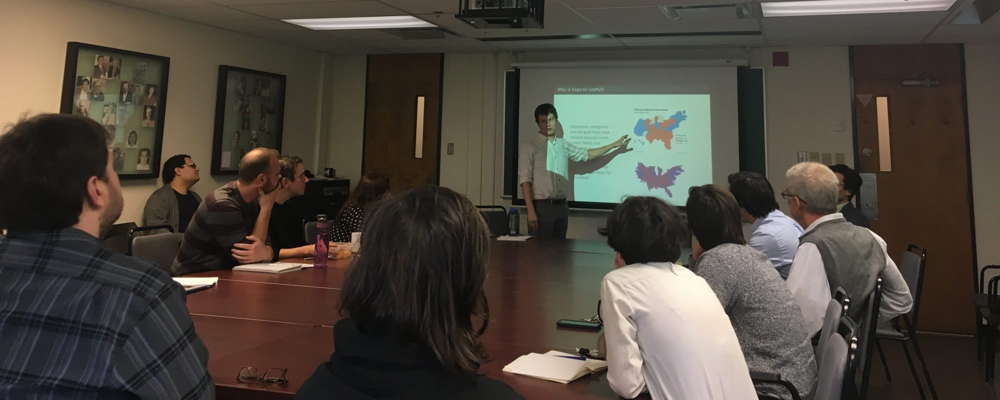

::: {.column-page}
{fig-alt="DemoTIP lab members presenting research"}
:::

Bringing together researchers interested in transparency, information provision, and participation (TIP), the DemoTIP laboratory applies state of the art research methods to bring answers to empirical problems in political science. Lab members test and challenge conventional theories regarding political transparency and accountability, the provision of political information, and citizen participation in democratic processes. Email if you are interested in getting involved!

## Principal Investigator

::: {.grid}
::: {.g-col-md-2 .g-col-12}
{.headshot fig-alt="Aaron Erlich"}
:::
::: {.g-col-md-10 .g-col-12}
**Aaron Erlich** is Associate Professor of Political Science at McGill University. He received his Ph.D. from the University of Washington in 2016. His wide-ranging research interests touch upon various themes such as democracy, political participation, the effect of information, and the development and use of advanced quantitative methods. His research has been published in journals such as the *American Political Science Review*, *Journal of Politics*, *Comparative Political Studies*, and many others.
:::
:::

## McGill Graduate & Post-Doc Researchers

::: {.grid}
::: {.g-col-md-2 .g-col-12}
{.headshot fig-alt="David Dubé"}
:::
::: {.g-col-md-10 .g-col-12}
**David Dubé** is a PhD candidate in Political Science at McGill University, interested in the informal political economy of post-communist Europe and Eurasia and the relationship between (mis)information, beliefs, and political behaviour in democratic, hybrid and authoritarian regimes. As a graduate student, David developed a growing interest in using statistical methods for causal inference and machine learning (natural language processing & computer vision) for large datasets and complex data analysis.
:::
:::

::: {.grid}
::: {.g-col-md-2 .g-col-12}
{.headshot fig-alt="Katerina McMullen"}
:::
::: {.g-col-md-10 .g-col-12}
**Katerina McMullen** is an M.A. student in Political Science at McGill University. Her research focuses on the socio-political analysis of large language models. Her thesis is assessing how LLMs handle and respond to queries about the US election when confronted with misleading or false information. She was awarded funding from the Social Science and Humanities Research Council (SSHRC) for that project.
:::
:::

::: {.grid}
::: {.g-col-md-2 .g-col-12}
{.headshot fig-alt="Aiden McIlvaney"}
:::
::: {.g-col-md-10 .g-col-12}
**Aiden McIlvaney** Aiden McIlvaney is an M.A. student in Political Science at McGill University. His research examines political behaviour & public opinion, political uses of technology, electoral governance, and cyber threats targeting democratic institutions, with a methodological focus on survey experiments and causal inference. He holds a SSHRC CGS-M and an FRQ Master’s Research Scholarship, and is a 2026–2027 CIGI Digital Policy Hub Fellow. His current work focuses on Canadian public attitudes towards the use of AI in electoral campaigns and attitudes towards the use of AI in defence and security.
:::
:::

::: {.grid}
::: {.g-col-md-2 .g-col-12}
{.headshot fig-alt="Alan Nemirovski"}
:::
::: {.g-col-md-10 .g-col-12}
**Alan Nemirovski** Alan Nemirovski is an M.A. student in Political Science at McGill University, supported by an FRQSC master's scholarship. He is interested in how emerging technologies and current issues in digital governance are changing political life and participation, from individuals to their social networks. Drawing on an interdisciplinary social sciences background, he approaches these questions with a methodological toolkit ranging from computational methods and statistical techniques to interpretive approaches.
:::
:::

## McGill Undergraduate Researchers

::: {.grid}
::: {.g-col-md-2 .g-col-12}
<!-- no headshot for Lawrence Plastina -->
:::
::: {.g-col-md-10 .g-col-12}
**Lawrence Plastina** is a third-year undergraduate student double majoring in political science and statistics. He was one of 29 recipients of McGill's 2024 Arts Undergraduate Research Internship Award, using quantitative methods to study Ukrainian self-reported firearm ownership under Prof. Erlich's supervision.
:::
:::

## DemoTIP Alumni

These students worked with me closely. The research and publications listed are just those completed with me during their time affiliated with the lab. For prospective students, this table gives you a good sense of the types of students who work with me.

Former lab members — if you need a letter of recommendation years after the fact, you're still in the rotation. Start at the [Letter of Recommendation](resources/letters.qmd) page.

Show / hide alumni table (click any column to sort)

<table class="sortable" id="alumni-table">
<thead><tr>
<th data-sort-method="string">Researcher</th>
<th data-sort-method="string">Degree</th>
<th data-sort-method="number">Graduation Year</th>
<th data-sort-method="string">Publications &amp; Research</th>
<th data-sort-method="string">Post-McGill Employment / Education</th>
</tr></thead>
<tbody>
<tr><td><strong>Rafael Campos-Gottardo</strong></td><td>M.A.</td><td>2025</td><td>Thesis - [The Impact of Political Violence on Levels of Polarization: Evidence from a Natural Experiment in the United Kingdom](https://mcgill.scholaris.ca/items/9ea27e1c-1f34-48b2-a58e-7335571f99a1)</td><td></td></tr>
<tr><td><strong>Mathieu Lavigne</strong></td><td>Ph.D.</td><td>2024</td><td>Thesis - [Resilient? Perceptions, Spread, and Impacts of Misinformation in the New Political Information Environment](https://escholarship.mcgill.ca/concern/theses/z603r346t)</td><td>Post-Doc, Dartmouth College</td></tr>
<tr><td><strong>Pratik Mahajan</strong></td><td>M.A.</td><td>2024</td><td>Thesis - [Ideological Transformation After Patron Cooptation? The Resilience of Ethno-Clientelist Ties Amid Hindu Nationalism in a Scheduled Tribe Constituency in India](https://escholarship.mcgill.ca/concern/theses/h415ph28t)</td><td>Ph.D student, Yale University</td></tr>
<tr><td><strong>Christopher Ross</strong></td><td>M.A.</td><td>2023</td><td>Thesis - [Elite Framing and Carbon Pricing: An Experiment in Embracing Expert Consensus](https://escholarship.mcgill.ca/concern/theses/w6634906j); [Unveiling: An Unexpected Mid-campaign Court Ruling's Consequences and the Limits of Following the Leader](https://doi.org/10.1086/711177)</td><td>[The Media Ecosystem Observatory](https://meo.ca/)</td></tr>
<tr><td><strong>Alice Brocheux</strong></td><td>B.A.</td><td>2022</td><td></td><td>Ph.D. Student, University of Rochester</td></tr>
<tr><td><strong>Costin Ciobanu</strong></td><td>Ph.D.</td><td>2022</td><td>Thesis - [The political and electoral consequences of economic shocks](https://escholarship.mcgill.ca/concern/theses/5d86p5382?locale=en); [Unveiling](https://doi.org/10.1086/711177)</td><td>Post-Doc, Royal Holloway University; Post-doc, University of Aarhus</td></tr>
<tr><td><strong>Dilse Kaygisiz</strong></td><td>M.A.</td><td>2022</td><td>Thesis - [Do laws affect attitudes? A study on domestic violence laws in Turkey](https://mcgill.scholaris.ca/items/346915d2-2a4a-40d2-a529-4aaecb5d3d1a)</td><td>[Data Sciences](https://datasciences.ca/)</td></tr>
<tr><td><strong>Henry Atkins</strong></td><td>M.A.</td><td>2021</td><td>Thesis - [Do Right-Wing Terror Attacks Change Minds about Out-groups? Evidence from the 2018 Macerata Attack](https://escholarship.mcgill.ca/concern/theses/z603r346t)</td><td></td></tr>
<tr><td><strong>Stefano Dantas</strong></td><td>M.A.</td><td>2021</td><td>[Multi-Label Prediction for Political Text-as-Data](https://doi.org/10.1017/pan.2021.15)</td><td></td></tr>
<tr><td><strong>Étienne Gagnon</strong></td><td>M.A.</td><td>2020</td><td>Thesis - Multiview Representation Learning for Political Science Research</td><td>[MEXT Fellowship, Japan](https://www.ca.emb-japan.go.jp/itpr_en/education.html); Ph.D. Student, Princeton University</td></tr>
<tr><td><strong>Saewon Park</strong></td><td>M.A.</td><td>2020</td><td>[Weaponizing Election Petitions](https://files.osf.io/v1/resources/tsmvz/providers/osfstorage/5ca5384824df750019c52f55?action=download&version=2&direct&format=pdf); Thesis - When Aid is not a Reward: Diaspora Activism and Democracy Aid Allocation</td><td>[TrackTik](https://www.tracktik.com/); [The Media Ecosystem Observatory](https://meo.ca/)</td></tr>
<tr><td><strong>Tanner Ducharme</strong></td><td>B.A.</td><td>2020</td><td></td><td></td></tr>
<tr><td><strong>Alex Xin Tong Wang</strong></td><td>M.A.</td><td>2020</td><td></td><td></td></tr>
<tr><td><strong>Hair Parra Barrera</strong></td><td>B.A.</td><td>2020</td><td></td><td>M.A., HEC-Montréal</td></tr>
<tr><td><strong>Su Goh</strong></td><td>B.A.</td><td>2020</td><td></td><td></td></tr>
<tr><td><strong>Annie Chen</strong></td><td>M.A.</td><td>2020</td><td>Thesis - [Incumbency Advantage in Australia](https://mcgill.scholaris.ca/items/cf050e75-9f47-42bb-bd56-717e2cc90aab); [Discriminatory Immigration Bans Elicit Anti-Americanism in Targeted Communities: Evidence from Nigerian Expatriates](https://doi.org/10.1017/XPS.2021.26)</td><td>[Bright Line Watch](http://brightlinewatch.org/)</td></tr>
<tr><td><strong>Andrew McCormack</strong></td><td>M.A.</td><td>2019</td><td>[mapcan R package](https://www.rdocumentation.org/packages/mapcan/versions/0.0.1); Thesis - Contextual Determinants of Policy Preferences: Local-Level Economic Inequality and Public Opinion in the US</td><td>[Data Sciences](https://datasciences.ca/)</td></tr>
<tr><td><strong>Aengus Bridgman</strong></td><td>Ph.D.</td><td>2022</td><td>[Unveiling](https://doi.org/10.1086/711177)</td><td>Assistant Prof (Research), McGill University</td></tr>
<tr><td><strong>Tim Roy</strong></td><td>B.A.</td><td></td><td></td><td></td></tr>
</tbody>
</table>

