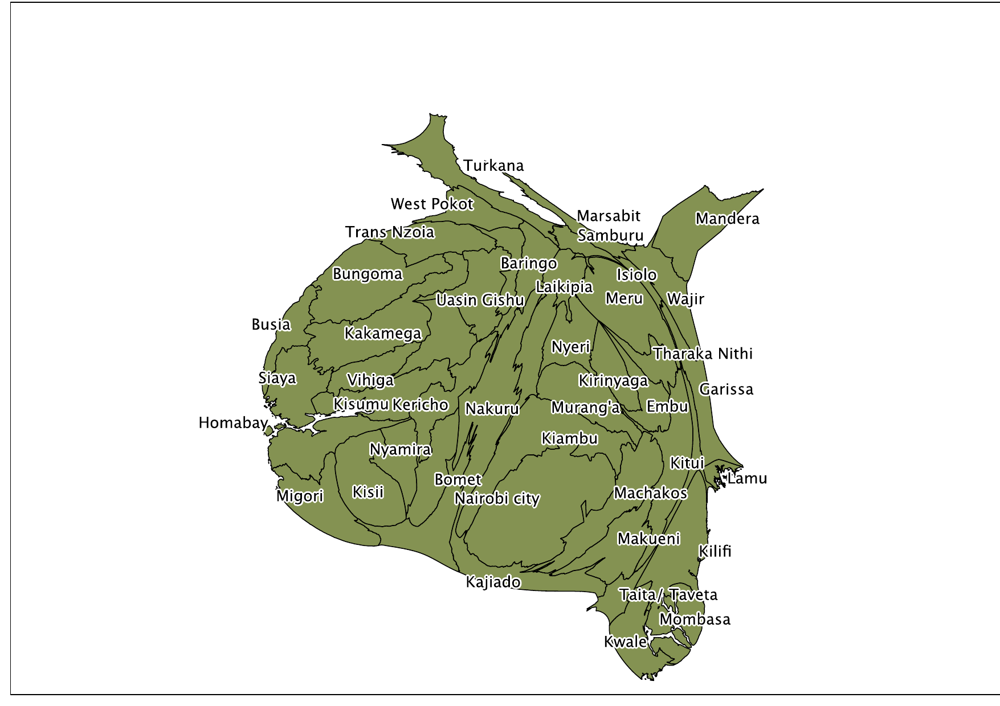
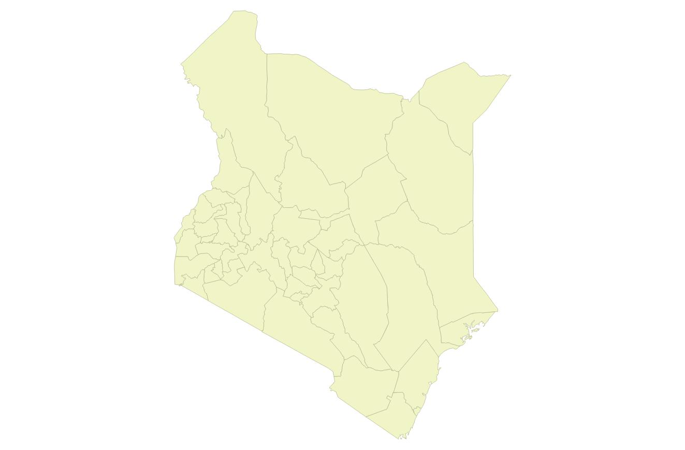

::: {.callout-note appearance="simple"}
Restored from my original WordPress blog (posted December 7, 2014).
:::

I was cleaning out my downloads folder, and I remembered I had made this cool map of
Kenya that uses the algorithm of Scharl and Weichselbraun to make a density equalizing map
of Kenya. This map shows each of Kenya's counties with the area proportional to the
voting-age population. You can see how unequal the county sizes are in the map.

{fig-alt="Cartogram of Kenya's counties distorted by voting-age population; the arid northern counties shrink while the highlands, Nairobi, and the Lake Victoria west expand."}

{fig-alt="Ordinary, undistorted map of Kenya's counties shown for comparison."}
