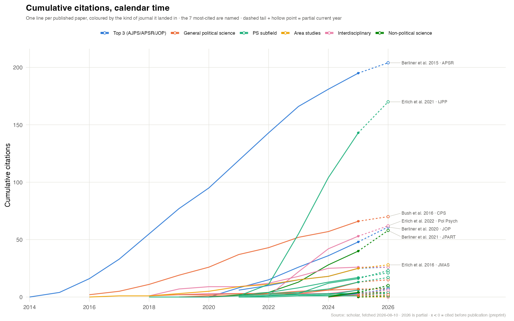
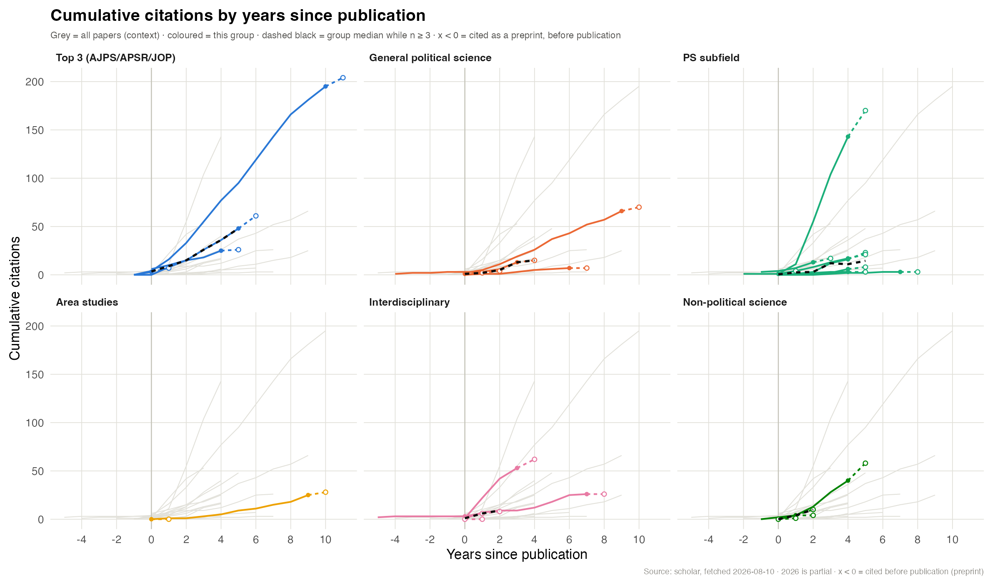
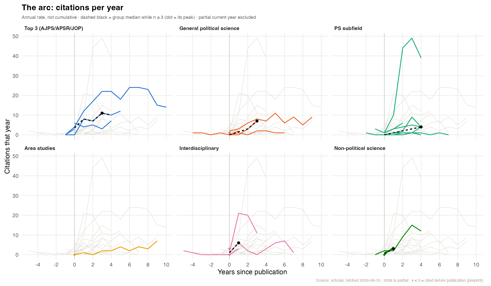

A few weeks ago I put my entire [**Publication Record**](../../submissions.qmd) online. A colleague followed-up with the same question: *did it actually matter where things landed?*

Of course, this is a very difficult causal inference problem that I am not going to answer. But, I pulled Google Scholar citation histories for all 30 published papers and colour-coded them by the kind of journal that took them: the top 3 (AJPS/APSR/JOP), other general political science, subfield journals, area studies, interdisciplinary, and outside political science entirely.

I provide three charts because they answer different questions.

## 1. The raw picture, and why it's nearly useless



One line per paper, running in calendar time. Vintage dominates this chart. "Total citations" mostly measures age: useful as a reminder, not as an answer. A 2015 APSR paper has had eleven years to accumulate, and everything else sits squashed underneath it. That paper was my early-career luck, and luck is something many have come to recognize as important in academia.

## 2. Aligned on publication — where the real pattern is



Here every paper restarts at its own year zero, faceted by journal type. Now the comparison between papers makes more sense, and one pattern survives it: **the top 3 have a much higher floor.**

At three years post-publication, my AJPS/APSR/JOP papers sit at 18, 26 and 55 citations. My subfield-journal papers at the same age run from 1 to 104.

The ceiling is not higher in the top 3. The basement is. For me, at least, that is not "publishing in the top 3 gets you cited more." It is closer to "publishing in the top 3 seems to protect you from being ignored."

Two things on that chart are worth explaining, because most citation graphics hide both:

**Negative years are real.** A paper circulates as a working paper long before it appears in an issue, and Scholar merges those citations into the published record. Four of my papers were cited before they were published; one of them five years before. Most citation tools quietly fold those into year zero, which both inflates the publication-year count and erases the fact that the working paper was doing work.

**The last year is dashed.** 2026 is incomplete. Drawing it solid would make every curve appear to flatten at exactly the same moment, which looks like a finding and is an artifact.

## 3. The arc — when papers actually peak



Cumulative curves can only go up, so they cannot show you when a paper peaked. This one can: it is citations *per year*, the rate rather than the running total.

It is also where the most unique paper in my record shows up. ["Is pro-Kremlin Disinformation Effective? Evidence from Ukraine"](https://doi.org/10.1177/19401612211045221) came out in the *International Journal of Press/Politics* in November 2021 — three months before the full-scale invasion. It went 1 → 10 → 44 → 49 citations a year. It is my second-most-cited paper, and it is in a subfield journal.

It has also already turned. Year four is down to 39 and falling. Compare the APSR paper, which peaked around year six at 24 citations a year and was still pulling 14 a decade out. One caught a topic shock; the other got a slow general-audience burn.

I would rather have the second. But I did not choose either — that is rather the point.

## What I got wrong when I first looked at this

Two things I was confident about did not survive contact with the data.

**"One paper is a quarter of my citations" is a fact about me.** My top paper is 21% of my total and my top three are 46%, and I assumed that lopsidedness said something. So I pulled the same numbers for ten co-author political scientists at my career stage or a little more senior. Median top-paper share: 23%. Median top-three share: 45%. I sit fifth of ten. The most concentrated person in the group has a single paper carrying 45% of their citations. Skew is not a personal quirk; it is the shape of the distribution for everyone.

**I have a low median paper citation count.** Those same profiles showed my median paper at 4 citations against a peer median of 12, and 55% of my entries under five citations against a peer median of 37%. That looked like a real and uncomfortable finding — normal top end, thin bottom end.

My first instinct was that my papers are just newer. That turned out to be wrong: restricting everyone to papers at least five years old did not improve the metric.

The actual explanation is duller and more important. I add lots of stuff to my Scholar profile. Indeed, my Scholar profile has 53 entries, but only 30 are published journal articles. The rest are working papers, an R package, conference drafts. Strip those out and my median goes from 4 to 8 and my under-five share from 55% to 33%. My peers' profiles have the same problem in wildly different amounts — one of them lists 114 entries, another 27.

So the median-citations-per-paper comparison was mostly measuring *how people curate their Scholar profiles*. I have no way to clean nine other people's profiles the way I can clean my own, which means I cannot make that comparison honestly at all. I have dropped it.

## A few caveats

This blog post analyzes 30 papers across six categories, and several of those categories hold two or three papers. The area studies panel has exactly two. It describes just one publication record (mine).

It does not identify a causal effect of journal placement. Topic, coauthors and timing are doing enormous work that I cannot separate out, and the Ukraine paper is a good argument against reading any of this as strategy. If there is a lesson, it is about floors rather than ceilings, and even that rests on three papers.

## Draw your own

None of this is specific to me, so, with the help of Claude Code, I packaged it up. Put in your ORCID (or search your name) and it draws the same three charts for your record, with your venues tiered against journals in your own topic area — so it works whether you are a political scientist, an economist or a biologist.

It runs **entirely in your browser**. Your identifier is sent to [OpenAlex](https://openalex.org) and nowhere else; there is no server of mine involved and nothing is logged. The first load pulls down a copy of R compiled to WebAssembly, so give it a moment.

```{shinylive-r}
#| standalone: true
#| viewerHeight: 720
#| components: [viewer]

```

A caveat on the numbers it shows you. This runs on OpenAlex, not Google Scholar, because Scholar has no API and blocks anything that is not a person at a browser. OpenAlex will report **fewer** citations than you are used to seeing — about two thirds, on my record. It ranks papers almost identically though (Spearman 0.94), and all three charts are about shape rather than level, so the picture holds even though the axis is smaller.

The code is at [**github.com/aserlich/scholar-arcs**](https://github.com/aserlich/scholar-arcs). The R package there does more than the widget: a Google Scholar backend for exact numbers when you run it on your own machine, an editable venue grouping, PNG and CSV export, and a peer-comparison view that samples researchers in your area so you can find out whether your own "one paper is a quarter of my citations" is unusual. (Mine was not.)

### How this was built

I should say plainly that I did not write most of this code. The analysis, the charts and the package were built with [Claude Code](https://claude.com/claude-code), with me making the calls that actually mattered: which journals belong in which group, that year zero should be first-published-online rather than the print date, that the comparison had to be anonymised, and which claims were strong enough to keep. Several of the findings above exist because the model pushed back on what I asked for — the "my median is low because my papers are just new" explanation was mine, and it was wrong; the data said so, and the claim had to go.

I could have written all of this R code. Many of us in quantitative political science could. What I did not have was three uninterrupted days to write it, and that is the actual constraint on most of the work like this academics would like to do but never do. The scarce input was not the R. It was the time to design and write the code.

That is the shift worth noticing. Not that the analysis became possible, but that it became cheap enough to be worth doing on a Sunday for a blog post.

### Tell me what is wrong with it

I would genuinely like this to be better, and there are several things I know are weak:

-   **Venue tiering is the shakiest part.** It ranks each journal against journals in your topic area by two-year mean citedness. I tried three reference populations before one behaved — the failures are documented in the code — and I am not confident the surviving one is right for fields with different citation cultures. If it puts your journals somewhere absurd, that is a bug worth reporting.
-   **OpenAlex sometimes merges two researchers into one profile.** If your results look like someone else's career is mixed into yours, that is why, and I would like to know how often it happens.
-   **Small groups give medians over one or two papers.** The charts draw them anyway. I have not found a presentation that makes the thinness visible without cluttering everything else.
-   **The peer comparison samples on topic and output only.** Career stage, subfield and coauthorship norms all matter and none are matched on.

Issues and pull requests are welcome at the repository, or just tell me what broke.

All of it is in R, generated from the same tidy submission log behind the Publication Record.